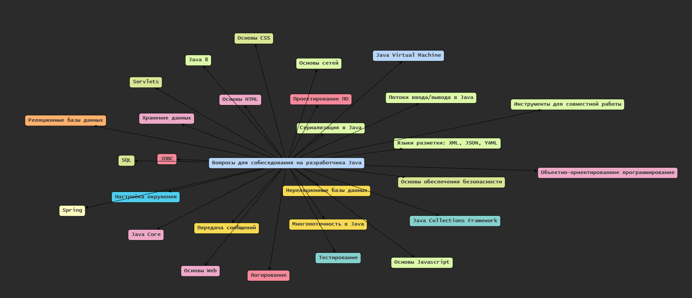
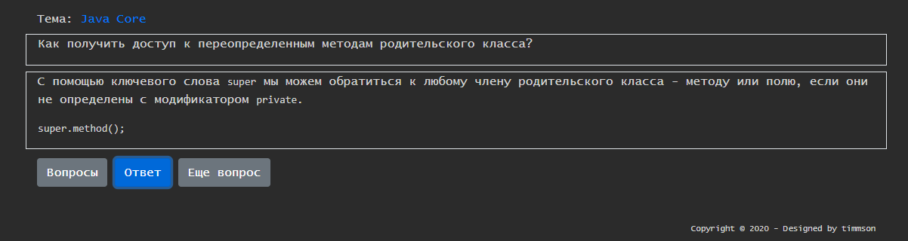

## Интеллект-карта

## Пройти опрос

## Оглавление

+ [Объектно-ориентированное программирование](001-oop.md)
+ [Проектирование ПО](002-sd.md)
+ [Java Virtual Machine](003-jvm.md)
+ [Java Core](004-core.md)
+ [Java Collections Framework](005-jcf.md)
+ [Java 8](006-java8.md)
+ [Потоки ввода/вывода в Java](007-io.md)
+ [Сериализация в Java](008-serialization.md)
+ [Многопоточность в Java](009-concurrency.md)
+ [Servlets](010-servlets.md)
+ [Spring](011-spring.md)
+ [JDBC](012-jdbc.md)
+ [ORM](013-orm.md)
+ [JMS](014-jms.md)
+ [Логирование](015-log.md)
+ [Тестирование](016-test.md)
+ [Koltin](020-kotlin.md)
+ [Хранение данных](030-db.md)
+ [Реляционные базы данных](031-rdbms.md)
+ [SQL](032-sql.md)
+ [Нереляционные базы данных](033-nosql.md)
+ [Передача сообщений](040-mq.md)
+ [Основы сетей](050-net.md)
+ [Настройка окружения](051-environment.md)
+ [Инструменты для совместной работы](052-tools.md)
+ [Основы обеспечения безопасности](053-security.md)
+ [Основы Web](060-web.md)
+ [Языки разметки: XML, JSON, YAML](061-ml.md)
+ [Основы HTML](062-html.md)
+ [Основы CSS](063-css.md)
+ [Основы Javascript](064-javascript.md)

Проект основан на [enhorse/java-interview](https://github.com/enhorse/java-interview).
